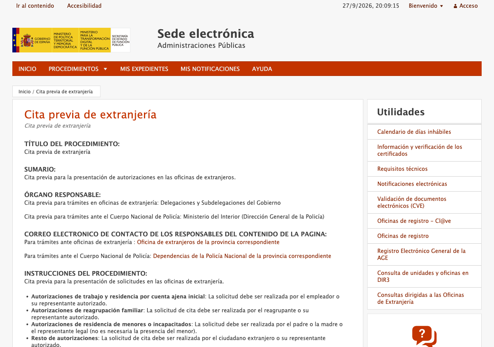
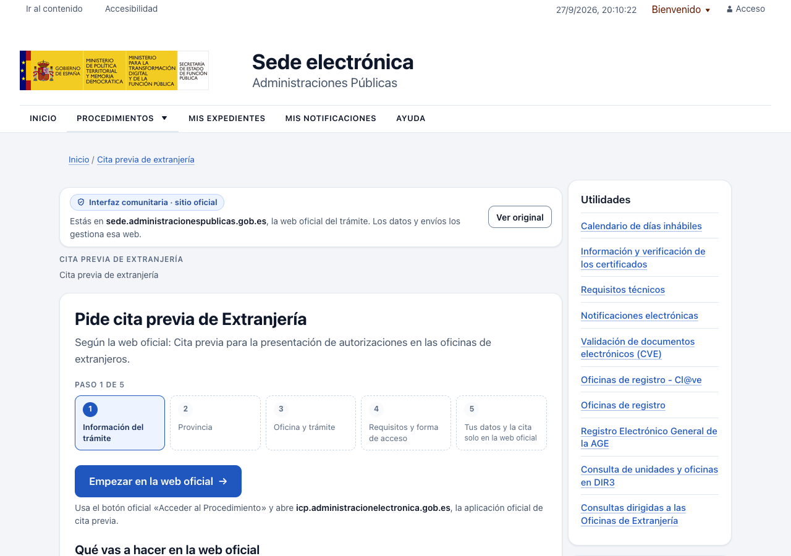
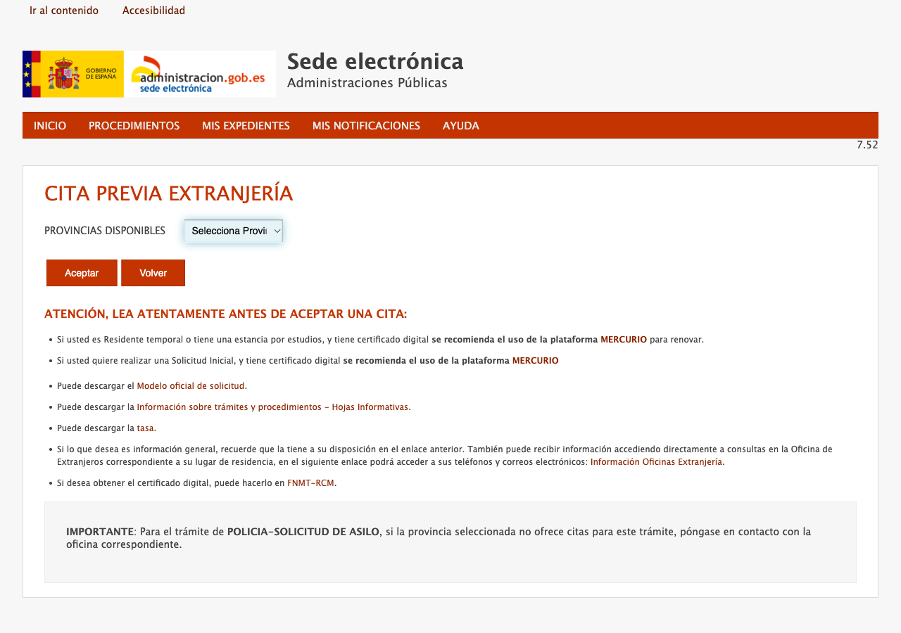
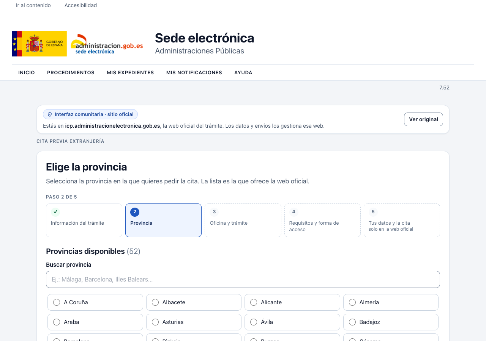
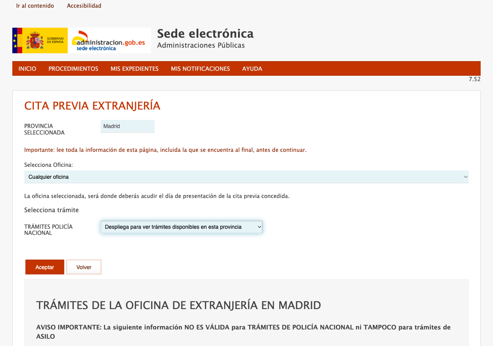
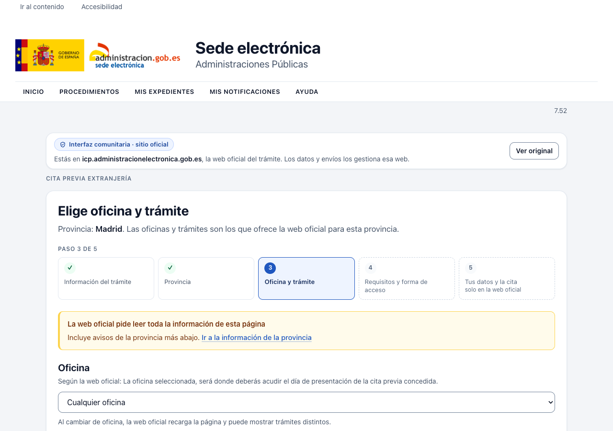
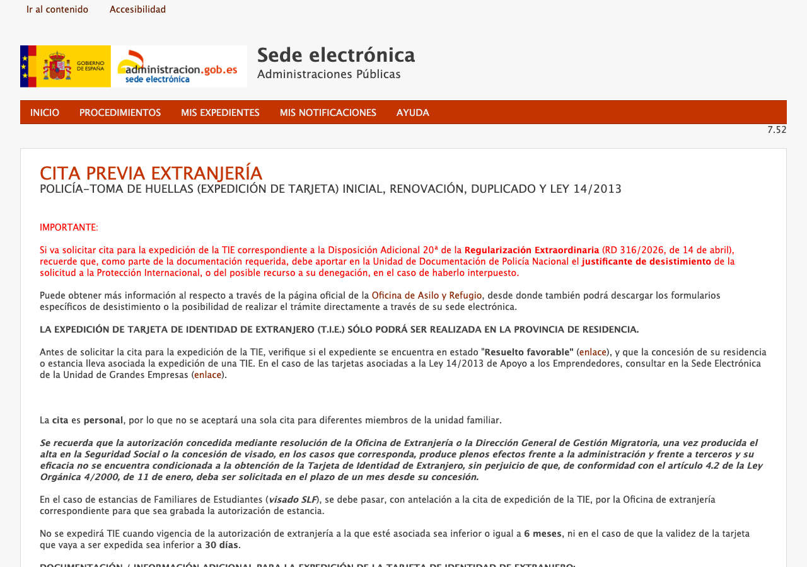
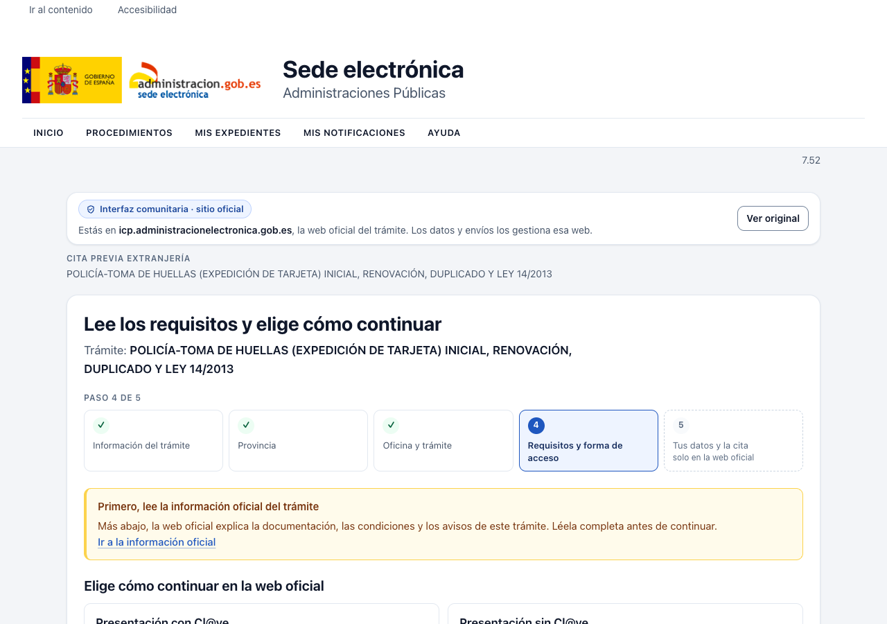

# Cita previa de Extranjería

Subproyecto del monorepo. Estado experimental; incluido en el build. Configuración en `site.config.json`, con rutas en dos dominios oficiales: la página informativa de la Sede y la aplicación de cita previa (ICP), que usa una ruta distinta según la provincia (`/icpplus/`, `/icpco/`, `/icpplustie/`, `/icpplustieb/`, `/icpplustiem/`).

## Pantallas

| Carpeta                 | Ruta                                    | Adaptación                                                                                                                                                                                                                                        |
| ----------------------- | --------------------------------------- | ------------------------------------------------------------------------------------------------------------------------------------------------------------------------------------------------------------------------------------------------- |
| `src/pages/landing/`    | `sede…/pagina/index/directorio/icpplus` | Guía con el sumario, quién debe pedir la cita y los organismos, leídos de la página. «Empezar» activa el botón oficial «Acceder al Procedimiento» (POST a la ICP)                                                                                 |
| `src/pages/provincias/` | `/<app>/index.html`                     | Buscador sin tildes y lista de provincias conectada al `select#form` oficial; «Continuar» activa `#btnAceptar`. Enlaces de los avisos oficiales                                                                                                   |
| `src/pages/tramites/`   | `/<app>/citar`, `/<app>/selectSede`     | Oficina (`select#sede`) y buscador de trámites agrupados por organismo (`tramiteGrupo[n]`), todo mediante el bridge. «Continuar» se habilita al elegir. Se repiten los errores oficiales y se avisa si aparecen mensajes o sub‑trámites oficiales |
| `src/pages/info/`       | `/<app>/acInfo`                         | Llamada a leer la información oficial y dos opciones equivalentes que activan «Presentación con Cl@ve» (`#btnAccesoClave`) y «sin Cl@ve» (`#btnEntrar`), declaradas como acciones `custom`                                                        |

Cada carpeta contiene `page.tsx` (interfaz y `prepare`) y `bindings.ts` (selectores revisados y extracción de datos). `src/components/` contiene los pasos, la búsqueda y la colocación de paneles; `src/styles/theme.css` aplica el tema Morfos del sistema de diseño y oculta **solo** los controles oficiales que el panel replica (DESIGN.md §4.2).

`acEntrada` (datos personales) y las pantallas siguientes no tienen pantalla registrada: conservan la interfaz original. La extensión no rellena datos, no resuelve el CAPTCHA, no consulta disponibilidad ni reserva, y no entra en Cl@ve.

## Evidencia y trabajo pendiente

El 27 de septiembre de 2026 se recorrió la web oficial con la extensión cargada en Chromium visible (`npm run site:live -- extranjeria`): Madrid, «Cualquier oficina», «POLICÍA‑TOMA DE HUELLAS…», hasta `acInfo`. Se comprobó que las selecciones del panel llegan a los controles oficiales y que la web oficial navega con sus propios botones. También que los avisos oficiales, la protección de datos y la información del trámite siguen visibles, y que desactivar el portal restaura la página. No se pulsó «con/sin Cl@ve» en la web real.

La estructura de la pantalla de trámites también se comprobó en Valencia, Barcelona y Alicante (esta última con dos grupos: Oficinas de Extranjería y Policía Nacional).

Los fixtures son **HTML real** de esas páginas públicas, sin scripts ni tokens de sesión. Las pruebas `tests/` cubren rutas, pantallas esperadas, DOM modificado, conexión con los controles oficiales, restauración y espera a contenido tardío. `tests/e2e/extranjeria.spec.ts` prueba la extensión cargada sobre esos fixtures en el laboratorio.

La ICP tarda varios segundos en pintar su contenido tras su comprobación anti‑bot; el runtime espera hasta 12 s. En modo headless la web muestra esa comprobación y las herramientas no intentan saltarla.

Pendiente: probar otras provincias y trámites completos; ver con contenido real el bloque de sub‑trámites (`#divSubTramites`) y los mensajes específicos de trámite (`#divMensajesTramite`), vacíos en el trámite probado; y traducir la interfaz (solo castellano).

## Capturas

«Original» y los paneles (`docs/screenshots/panel-*.png`) proceden de `npm run site:live -- extranjeria` sobre la web real. «Con Better Government» procede de `npm run site:preview -- extranjeria`, que reproduce sin conexión una visita real grabada ese mismo día. Móvil: `docs/screenshots/movil-2-provincias.png`.

| Paso                | Original                                        | Con Better Government                           |
| ------------------- | ----------------------------------------------- | ----------------------------------------------- |
| Información         |     |     |
| Provincia           |  |  |
| Oficina y trámite   |    |    |
| Requisitos y acceso |        |        |
